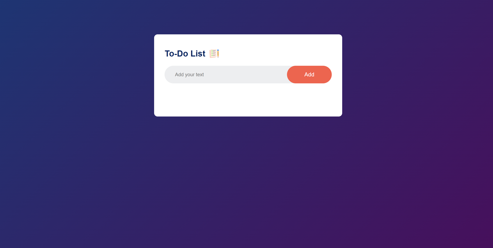

# 📌 To-Do List 📝

An interactive To-Do list webpage built using **HTML, CSS, and JavaScript** to help users manage their tasks efficiently.

## 📸 Screenshot 🖼️


## 🚀 Features ✨
- ✅ Add new tasks with ease.
- ✔️ Mark tasks as completed.
- ❌ Delete tasks when done.
- 📱 Responsive design for mobile and desktop.
- 💾 Data persistence using localStorage.

## 🛠️ Technologies Used 🔧
- 🏗️ **HTML** for the structure
- 🎨 **CSS** for styling and responsiveness
- ⚡ **JavaScript** for interactivity

## 📂 Project Structure 📁
```
📁 todo-webpage/
│-- 📄 index.html  (Main HTML file)
│-- 🎨 style.css   (CSS for styling)
│-- ⚡ script.js   (JavaScript for functionality)
│-- 📜 README.md   (Project documentation)
│-- 🖼️ screenshot.png (Project preview)
```

## 📥 Installation & Usage ⬇️
1. Clone the repository:
   ```bash
   git clone https://github.com/shelavalepallavi/todo-list.git
   ```
2. Navigate to the project folder:
   ```bash
   cd todo-list
   ```
3. Open `index.html` in your browser.

## 🎯 How to Use 🏆
1. ✍️ Enter a task in the input field and click **Add**.
2. 🏁 Click on a task to mark it as completed.
3. 🗑️ Click the **❌ Delete** button to remove a task.

## 💡 Future Enhancements 🔮
- 🖱️ Drag-and-drop functionality.
- 🌙 Dark mode support.
- 🗂️ Task categories.
- 🔗 Backend integration for user authentication.

## 🤝 Contributing 🤗
Feel free to fork this repository, create a new branch, and submit a pull request with improvements!
